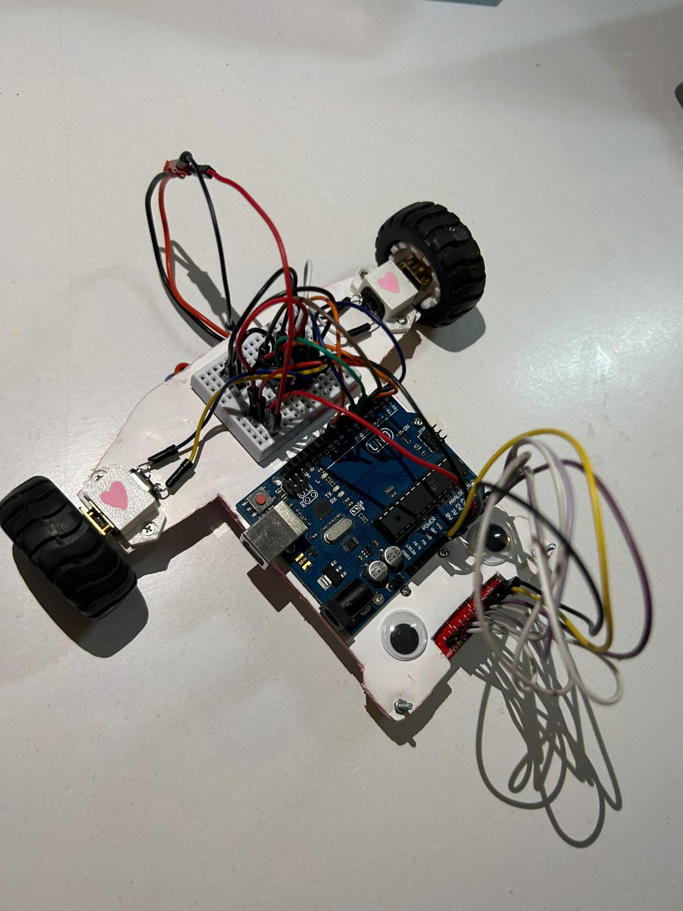
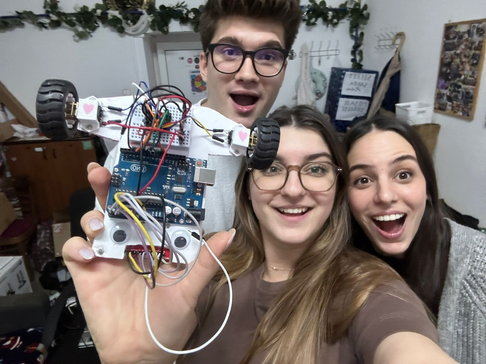

# Line Follower 🏁

This is our last project for the Introduction to Robotics course at the University of Bucharest, where we're diving into making a line follower. It's a hands-on challenge where the requirement is to design a robot to follow a marked path accurately and in the shortest possible time. To achieve this, we used PID, a control loop mechanism employing feedback.

## Components 🔧

<ul>
  <li> Arduino Uno
  <li> LiPo battery as a power source
  <li> Wheels (2)
  <li> QTR-8A reflectance sensor
  <li> Ball caster
  <li> Chassis (made of foam board)
  <li> Breadboard
  <li> L293D motor driver
  <li> DC motors (2)
</ul>  

## Project design ✨

Our first (small) challenge for this project was making the chassis from a simple piece of foam board. Spoiler alert: we ended up nailing it.

We started by mounting the ball caster and the QTR sensor with their screws in the front of our car. We then began placing the remaining components in various forms before getting the best setup: the Arduino uno board was placed in the center of the chassis, making it easy for us to connect the USB cable to the laptop for uploading the code. As for the LiPo battery, we secured it under the chassis for giving our little car a lower center of gravity and perfectly balancing the center-back area where only the small breaboard was placed,right between the two motor-wheel pairs.

After making sure that all of the mechanical aspects were perfected, we gave life to our car by adding small details that would make it stand out.

  

## Course video  🏎

You can see our car racing [here](https://www.youtube.com/watch?v=PBthNTN-ukI) . 

PS: in the video above our car was still shaking with emotion as it was recorder right after our actual presentation where our best time was 18.6 (when we were too excited to remeber we had to record it) .

## Free Fall Team 🤜🤛

I teamed up with [Cosmina Barbu](https://github.com/cosminabarbu) and [Radu Nedelcu](https://github.com/Pepi100).

  

